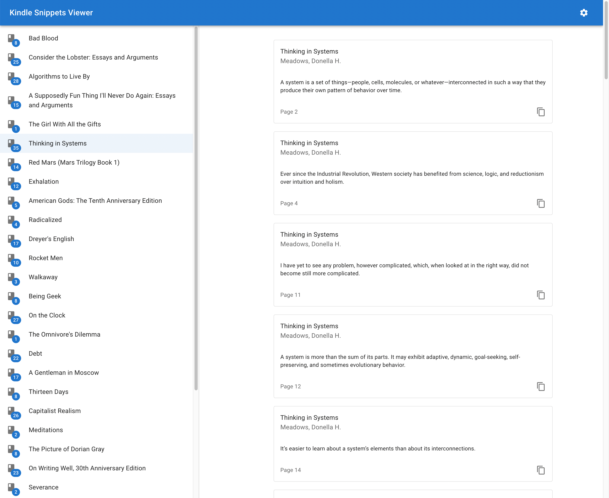

# kindle-snippets

A small in-browser Kindle Snippets viewer. Some more details can be found
[here](https://benjamincongdon.me/blog/2022/03/06/Kindle-Snippets-Viewer/).

You can view a deployed version of this app at
✨[kindle-snippets.netlify.app](https://kindle-snippets.netlify.app/)✨.

**Screenshot:**

## Building and Testing

In the project directory, you can run:

### `npm start`

Runs the app in the development mode.\
Open [http://localhost:3000](http://localhost:3000) to view it in the browser.

The page will reload if you make edits.\
You will also see any lint errors in the console.

### `npm run build`

Builds the app for production to the `build` folder.\
It correctly bundles React in production mode and optimizes the build for the best
performance.

The build is minified and the filenames include the hashes.\
Your app is ready to be deployed!

See the section about
[deployment](https://facebook.github.io/create-react-app/docs/deployment) for
more information.

### `npm test`

Launches the test runner in the interactive watch mode.\
See the section about [running tests](https://facebook.github.io/create-react-app/docs/running-tests)
for more information.

## Acknowledgements

This project was bootstrapped with
[Create React App](https://github.com/facebook/create-react-app).
